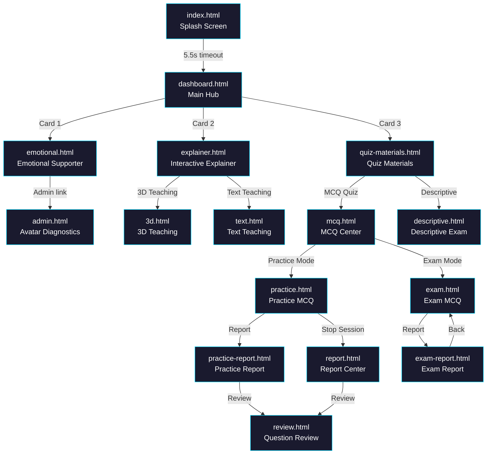
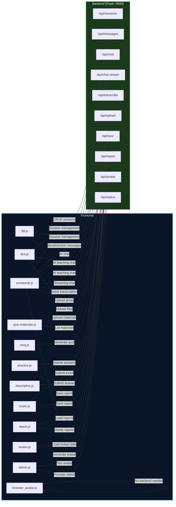
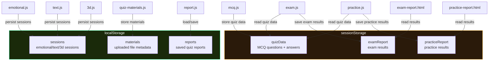

# Falcon AI Frontend - Project Map

## 1. Overview

Falcon AI is an AI-powered educational platform with three core modules:
- **Emotional Supporter** - AI chat with avatar, lip-sync, voice, and audio visualization
- **Interactive Explainer** - Text-based and 3D holographic teaching modes
- **Quiz Assistant** - Upload materials, generate MCQ/descriptive quizzes, take exams, view reports

**Tech Stack:** Vanilla HTML/CSS/JS (no frameworks, no build system)
**Backend:** Python Flask at `http://127.0.0.1:5000`
**Static Server:** Python HTTP server at `http://127.0.0.1:5500`
**Voice Input:** MediaRecorder + Vosk (local speech-to-text, no API key)
**TTS:** Browser SpeechSynthesis API, gated behind voiceMode toggle

---

## 2. Page Navigation Flow

---

## 3. Frontend-to-Backend API Routes

---

## 4. Client-Side Data Flow

---

## 5. Reference Files Index

### HTML Files (15)
| File | Reference | Purpose |
|------|-----------|---------|
| `index.html` | [index-html.md](./references/index-html.md) | Splash/loading screen, redirects to dashboard |
| `dashboard.html` | [dashboard-html.md](./references/dashboard-html.md) | Main hub with 3 feature cards |
| `emotional.html` | [emotional-html.md](./references/emotional-html.md) | Emotional supporter chat + SVG avatar + upload |
| `explainer.html` | [explainer-html.md](./references/explainer-html.md) | Explainer sub-menu (3D or Text) |
| `text.html` | [text-html.md](./references/text-html.md) | Text-based AI teaching chat |
| `3d.html` | [3d-html.md](./references/3d-html.md) | 3D holographic teaching interface |
| `quiz-materials.html` | [quiz-materials-html.md](./references/quiz-materials-html.md) | Upload study materials for quiz generation |
| `mcq.html` | [mcq-html.md](./references/mcq-html.md) | MCQ mode selector (Practice vs Exam) |
| `practice.html` | [practice-html.md](./references/practice-html.md) | Practice MCQ quiz with instant feedback |
| `exam.html` | [exam-html.md](./references/exam-html.md) | Timed MCQ exam (15/30/60 questions) |
| `descriptive.html` | [descriptive-html.md](./references/descriptive-html.md) | Descriptive text/file-based exam |
| `report.html` | [report-html.md](./references/report-html.md) | Report center with grade + history sidebar |
| `exam-report.html` | [exam-report-html.md](./references/exam-report-html.md) | Exam report display (inline script) |
| `practice-report.html` | [practice-report-html.md](./references/practice-report-html.md) | Practice report with review cards (inline script) |
| `review.html` | [review-html.md](./references/review-html.md) | Question review display |
| `admin.html` | [admin-html.md](./references/admin-html.md) | Avatar provider diagnostics dashboard |

### JavaScript Files (12)
| File | Reference | Purpose |
|------|-----------|---------|
| `emotional.js` | [emotional-js.md](./references/emotional-js.md) | Avatar system, lip-sync, TTS, voice input, audio visualizer, sessions, chat |
| `text.js` | [text-js.md](./references/text-js.md) | Text teaching: chat, sessions, copy/examples/quiz/regen, voice, PDF export |
| `3d.js` | [3d-js.md](./references/3d-js.md) | 3D teaching: sessions, visualizer, text/voice chat, speech synthesis |
| `quiz-materials.js` | [quiz-materials-js.md](./references/quiz-materials-js.md) | Material upload (drag & drop), material selection/deletion |
| `mcq.js` | [mcq-js.md](./references/mcq-js.md) | Quiz generation via backend API, mode routing |
| `practice.js` | [practice-js.md](./references/practice-js.md) | Practice MCQ: load questions, answer submission, feedback, report |
| `exam.js` | [exam-js.md](./references/exam-js.md) | Exam MCQ: timer, navigator, answer tracking, auto-submit, report |
| `descriptive.js` | [descriptive-js.md](./references/descriptive-js.md) | Descriptive exam: text area, file upload, timer, draft save, submit |
| `report.js` | [report-js.md](./references/report-js.md) | Report center: load/display reports, grade calc, history, deletion |
| `review.js` | [review-js.md](./references/review-js.md) | Review display: merges practice + exam data, renders review cards |
| `browser_avatar.js` | [browser-avatar-js.md](./references/browser-avatar-js.md) | Browser-side avatar: bilateral filter, color quantization, edge overlay |
| `admin.js` | [admin-js.md](./references/admin-js.md) | Admin diagnostics: provider status, test generation, auto-refresh |

### CSS Files (14)
| File | Reference | Purpose |
|------|-----------|---------|
| `emotional.css` | [emotional-css.md](./references/emotional-css.md) | Avatar animations, particles, chat bubbles, dropdown, modal |
| `3d.css` | [3d-css.md](./references/3d-css.md) | Space scene, hologram, AI bot rings, stars, nebula |
| `text.css` | [text-css.md](./references/text-css.md) | Teaching sidebar, chat area, markdown rendering |
| `quiz-materials.css` | [quiz-materials-css.md](./references/quiz-materials-css.md) | Upload UI, material cards, processing bar |
| `explainer.css` | [explainer-css.md](./references/explainer-css.md) | Space scene, cards |
| `dashboard.css` | [dashboard-css.md](./references/dashboard-css.md) | Navbar, cards, particles, glow effects |
| `descriptive.css` | [descriptive-css.md](./references/descriptive-css.md) | Sidebar, answer box, stats |
| `practice.css` | [practice-css.md](./references/practice-css.md) | Stats grid, question card, feedback |
| `review.css` | [review-css.md](./references/review-css.md) | Review cards, answer states, explanation boxes |
| `mcq.css` | [mcq-css.md](./references/mcq-css.md) | Mode cards, hero section |
| `report.css` | [report-css.md](./references/report-css.md) | Stats, grade display, sidebar |
| `exam.css` | [exam-css.md](./references/exam-css.md) | Navigator grid, timer, question card |
| `exam-report.css` | [exam-report-css.md](./references/exam-report-css.md) | Stats grid, score card |
| `practice-report.css` | [practice-report-css.md](./references/practice-report-css.md) | Stats, review section |
| `admin.css` | [admin-css.md](./references/admin-css.md) | Provider cards |
| `style.css` | [style-css.md](./references/style-css.md) | Splash screen: loading bar, animations |

### Config/Support Files (1)
| File | Reference | Purpose |
|------|-----------|---------|
| `server.py` | [server-py.md](./references/server-py.md) | Python HTTP server on port 5500 |
