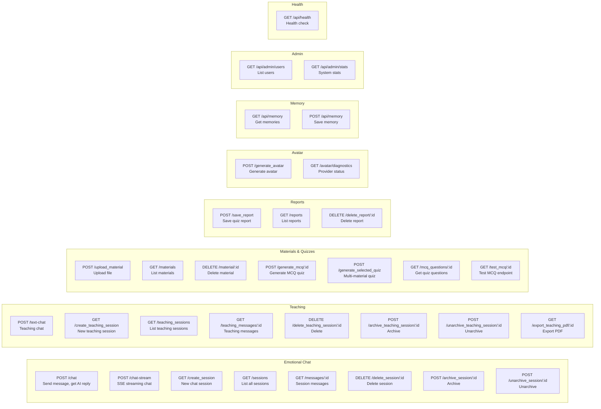
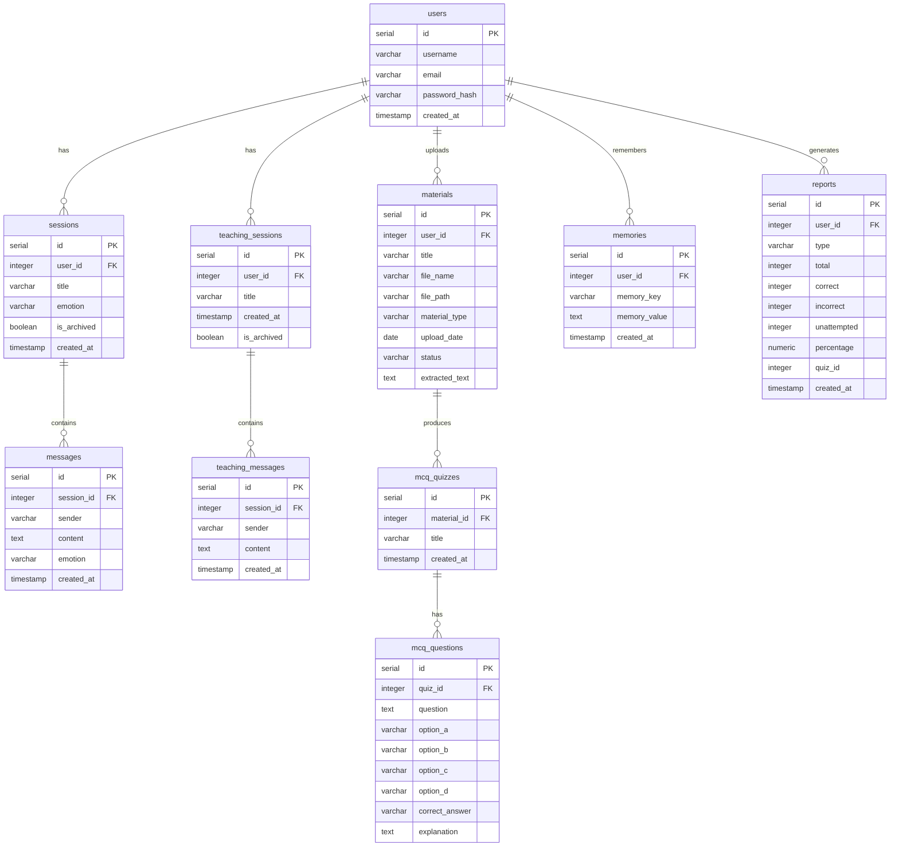
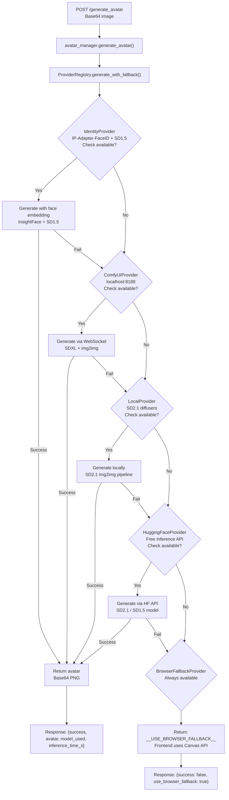

# Falcon AI Backend — Project Map

## Overview

Falcon AI is an emotional support assistant and teaching platform backend built with **Python 3.10+**, **Flask**, and **PostgreSQL**. It provides an AI-powered chat system with emotion detection, a teaching/tutoring platform with material upload and quiz generation, and an avatar generation pipeline with multi-provider fallback.

- **Framework**: Flask with CORS
- **Database**: PostgreSQL via psycopg2
- **AI**: OpenRouter API (GPT-OSS-120B, Mistral-7B fallback)
- **Avatar**: Multi-provider system (Identity → ComfyUI → Local → HuggingFace → Browser)
- **Text Extraction**: PDF, DOCX, PPTX, images (OCR), TXT

---

## Architecture & Setup

### Prerequisites

- Python 3.10+
- PostgreSQL (database: `falcon_ai`, user: `postgres`)
- OpenRouter API key
- HuggingFace API key (optional, for avatar generation)

### Environment Variables

Set in `.env` at the project root (`Falcon_AI/.env`):

```
OPENROUTER_API_KEY=your_key_here
HF_API_KEY=your_key_here
```

### Install & Run

```bash
cd backend
pip install -e .
python app.py
```

Flask starts on `http://localhost:5000` with CORS enabled for all origins.

### Optional Extras

```bash
pip install -e ".[avatar]"   # torch, diffusers, insightface for local avatar generation
pip install -e ".[ocr]"       # pytesseract, pdf2image, python-docx, python-pptx
pip install -e ".[dev]"       # pytest, ruff, mypy
```

---

## Visual Diagrams

### API Routes



### Database ER



### Provider System Flow



---

## Key Features / API Endpoints

### Emotional Chat

| Method | Path | Description | Request Body / Params | Response |
|--------|------|-------------|----------------------|----------|
| POST | `/chat` | Send message, get AI reply with emotion detection | `{message, session_id}` | `{reply, title, emotion}` |
| GET | `/create_session` | Create new chat session | — | `{session_id}` |
| GET | `/sessions` | List all sessions for user | — | `[{id, title, emotion, is_archived}]` |
| GET | `/messages/:session_id` | Get messages for a session | — | `[{sender, content, emotion}]` |
| DELETE | `/delete_session/:session_id` | Delete session and messages | — | `{success}` |
| POST | `/archive_session/:session_id` | Archive a session | — | `{success}` |
| POST | `/unarchive_session/:session_id` | Unarchive a session | — | `{success}` |

### Teaching Platform

| Method | Path | Description | Request Body / Params | Response |
|--------|------|-------------|----------------------|----------|
| POST | `/text-chat` | Teaching chat with AI tutor | `{message, session_id}` | `{reply}` |
| GET | `/create_teaching_session` | Create new teaching session | — | `{session_id}` |
| GET | `/teaching_sessions` | List all teaching sessions | — | `[{id, title, is_archived}]` |
| GET | `/teaching_messages/:session_id` | Get teaching messages | — | `[{sender, content}]` |
| DELETE | `/delete_teaching_session/:session_id` | Delete teaching session | — | `{success}` |
| POST | `/archive_teaching_session/:session_id` | Archive teaching session | — | `{success}` |
| POST | `/unarchive_teaching_session/:session_id` | Unarchive teaching session | — | `{success}` |
| GET | `/export_teaching_pdf/:session_id` | Export session as PDF report | — | PDF file download |

### Materials & Quiz Generation

| Method | Path | Description | Request Body / Params | Response |
|--------|------|-------------|----------------------|----------|
| POST | `/upload_material` | Upload study material (PDF/DOCX/PPTX/image) | `multipart/form-data: file` | `{success, material_id, filename}` |
| GET | `/materials` | List all uploaded materials | — | `[{id, title, type, upload_date}]` |
| DELETE | `/material/:material_id` | Delete material and its quizzes | — | `{success}` |
| POST | `/generate_mcq/:material_id` | Generate MCQ quiz from material text | — | `{success, quiz_id, questions_saved}` |
| POST | `/generate_selected_quiz` | Generate quiz from multiple materials | `{material_ids, question_count}` | `{success, quiz_id, questions_saved}` |
| GET | `/mcq_questions/:quiz_id` | Get MCQ questions for a quiz | — | `[{question, option_a-d, correct_answer, explanation}]` |
| GET | `/test_mcq/:material_id` | Test endpoint for MCQ generation | — | (same as generate_mcq) |

### Reports

| Method | Path | Description | Request Body / Params | Response |
|--------|------|-------------|----------------------|----------|
| POST | `/save_report` | Save quiz result report | `{type, total, correct, incorrect, unattempted, percentage, quiz_id}` | `{success, report_id}` |
| GET | `/reports` | List all reports | — | `[{id, type, total, correct, incorrect, unattempted, percentage, created_at}]` |
| DELETE | `/delete_report/:report_id` | Delete a report | — | `{success}` |

### Avatar Generation

| Method | Path | Description | Request Body / Params | Response |
|--------|------|-------------|----------------------|----------|
| POST | `/generate_avatar` | Generate AI avatar from photo | `{image: "base64..."}` | `{success, avatar, model_used, inference_time_s}` |
| GET | `/avatar/diagnostics` | Provider status and availability | — | `{active_provider, providers[], total_providers, available_count}` |

### Memory

| Method | Path | Description | Request Body / Params | Response |
|--------|------|-------------|----------------------|----------|
| GET | `/api/memory` | Get all memories for user | — | `[{key, value}]` |
| POST | `/api/memory` | Save a memory | `{key, value}` | `{success}` |

### Admin

| Method | Path | Description | Request Body / Params | Response |
|--------|------|-------------|----------------------|----------|
| GET | `/api/admin/users` | List all registered users | — | `[{id, username, email, created_at}]` |
| GET | `/api/admin/stats` | System statistics | — | `{total_users, total_sessions, ...}` |

### Health

| Method | Path | Description | Response |
|--------|------|-------------|----------|
| GET | `/api/health` | Health check endpoint | `{status: "ok"}` |

---

## Data Structure & Persistence

### PostgreSQL Schema

**Connection**: `psycopg2.connect(database="falcon_ai", user="postgres")`

| Table | Purpose | Key Columns |
|-------|---------|-------------|
| `users` | User accounts | `id`, `username`, `email`, `password_hash`, `created_at` |
| `sessions` | Emotional chat sessions | `id`, `user_id` → users, `title`, `emotion`, `is_archived`, `created_at` |
| `messages` | Chat messages | `id`, `session_id` → sessions, `sender`, `content`, `emotion`, `created_at` |
| `teaching_sessions` | Teaching/tutoring sessions | `id`, `user_id` → users, `title`, `created_at`, `is_archived` |
| `teaching_messages` | Teaching chat messages | `id`, `session_id` → teaching_sessions, `sender`, `content`, `created_at` |
| `materials` | Uploaded study files | `id`, `user_id` → users, `title`, `file_name`, `file_path`, `material_type`, `upload_date`, `status`, `extracted_text` |
| `mcq_quizzes` | Generated quiz containers | `id`, `material_id` → materials, `title`, `created_at` |
| `mcq_questions` | Individual quiz questions | `id`, `quiz_id` → mcq_quizzes, `question`, `option_a`–`option_d`, `correct_answer`, `explanation` |
| `memories` | User memory key-value store | `id`, `user_id` → users, `memory_key`, `memory_value`, `created_at` |
| `reports` | Quiz result reports | `id`, `user_id` → users, `type`, `total`, `correct`, `incorrect`, `unattempted`, `percentage`, `quiz_id`, `created_at` |

### Cascade Behavior

- Deleting a `sessions` row deletes its `messages`
- Deleting a `teaching_sessions` row deletes its `teaching_messages`
- Deleting a `materials` row deletes its `mcq_quizzes` → `mcq_questions`

---

## Reference Index

| File | Lines | Purpose |
|------|-------|---------|
| `app.py` | 1560 | Main Flask app, all API routes, OpenRouter integration, PDF export |
| `database.py` | 727 | PostgreSQL CRUD layer, all database operations |
| `extractor.py` | 161 | Text extraction from PDF, DOCX, PPTX, images (OCR), TXT |
| `avatar_manager.py` | 100 | Avatar generation orchestrator, provider priority chain |
| `providers/base.py` | 154 | Abstract `AvatarProvider` base class, `ProviderRegistry`, fallback logic |
| `providers/identity_provider.py` | 156 | IP-Adapter-FaceID + SD1.5 (highest priority, face-embedding preserving) |
| `providers/comfyui_provider.py` | 161 | ComfyUI WebSocket integration on localhost:8188 |
| `providers/local_provider.py` | 119 | Local SD2.1 diffusers img2img pipeline |
| `providers/huggingface_provider.py` | 145 | HuggingFace free Inference API (rate-limited) |
| `providers/browser_fallback.py` | 14 | Canvas API browser fallback signal |
| `providers/__init__.py` | 17 | Provider imports and `__all__` exports |
| `falcon.sql` | — | PostgreSQL schema dump |
| `pyproject.toml` | 84 | Project config, dependencies, dev tools |
| `.gitignore` | — | venv, pycache exclusions |
